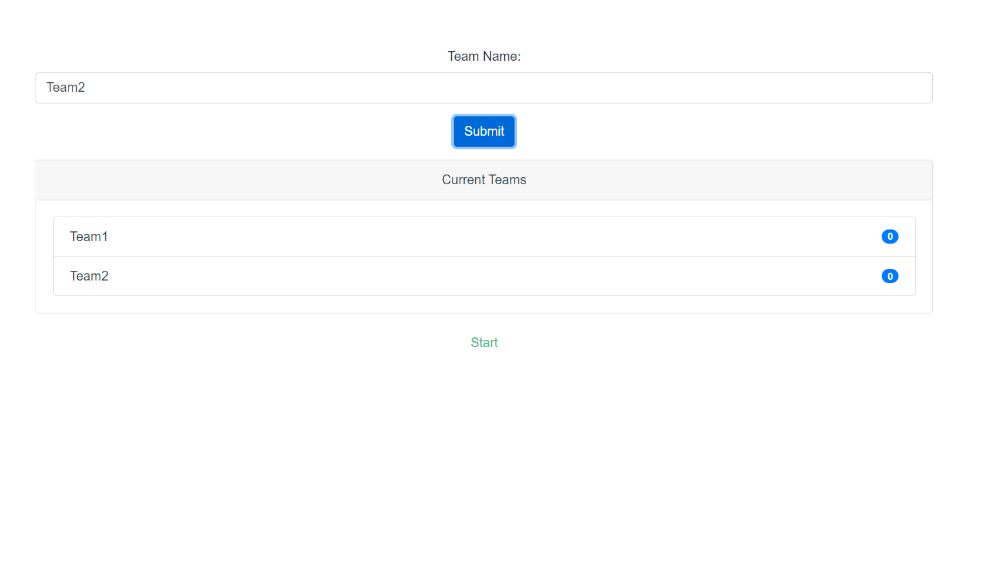
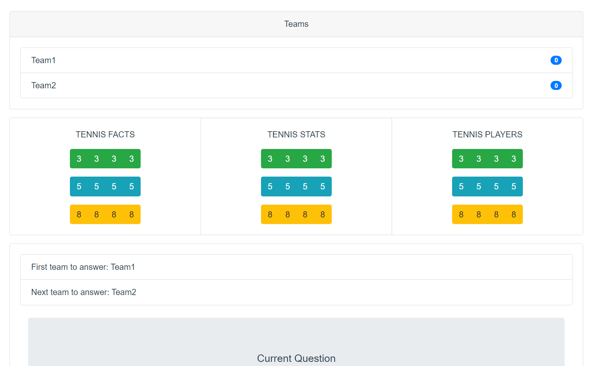
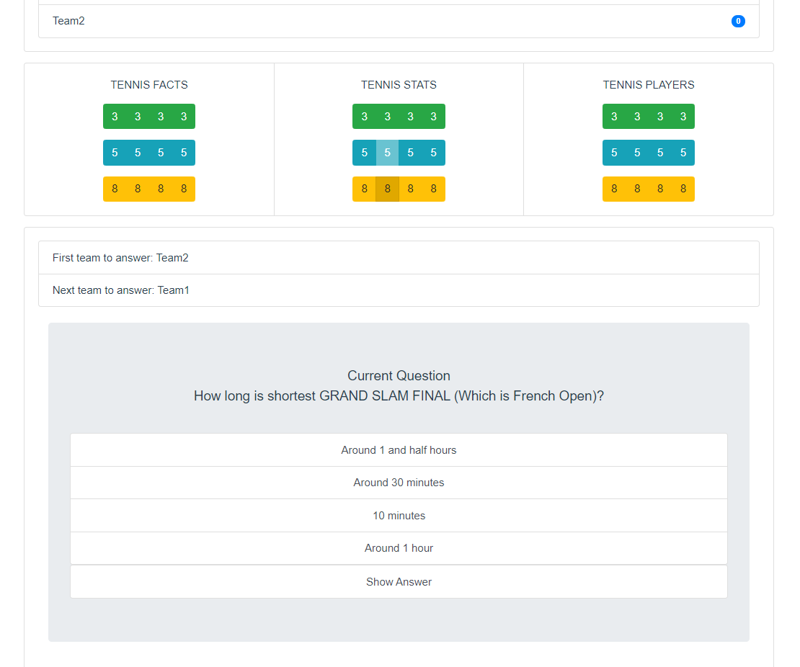

# trivia

## Project setup
```
npm install
```

### Compiles and hot-reloads for development
```
npm run serve
```

# Before you start

## Create your own questions

Each category you create has following format,
```
CATEGORY: TENNIS FACTS

QE: Questions Content?  # Note: QE/QM/QH means easy/medium/hard and each question worth 3, 5, 8 points perspectively
IMG: file_name  # Note: this is optional, all images needed to placed under src/assets/ folder
A: BILLIE JEAN KING  # Note: first answer is always the correct answer, and all answers will be shuffled during the game
A: CHRIS EVERT-LLOYD
A: MARGARET COURT
A: MARTINA NAVRATILOVA

...
```

## Parse your questions
```
cd script
python parseRound1.py {your_question_file.txt} ../src/assets/Round1.json
```

# Start the game
```npm run serve```

- Open broswer and go to localhost:8080

- Enter the teams (at least two teams required)


- Press "Start"
- "Next team to answer:" will choose answer by pressing the button from the page

- "First team to answer:" will start answer the question as follow

- "Next team to answer:" will have chance to steal half of the question points by answering correctly or lose 1 point if wrong after "First team to answer:" answer wrong
- After this question is done, "Next team to answer:" will choose another question
